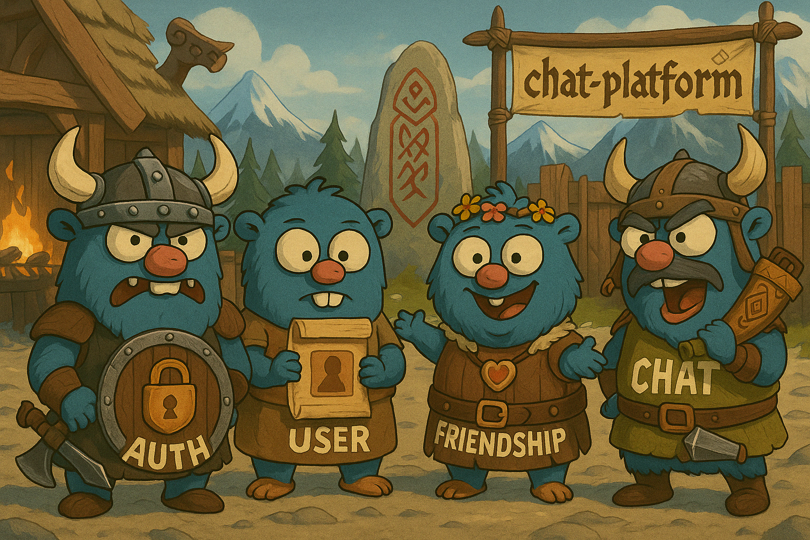
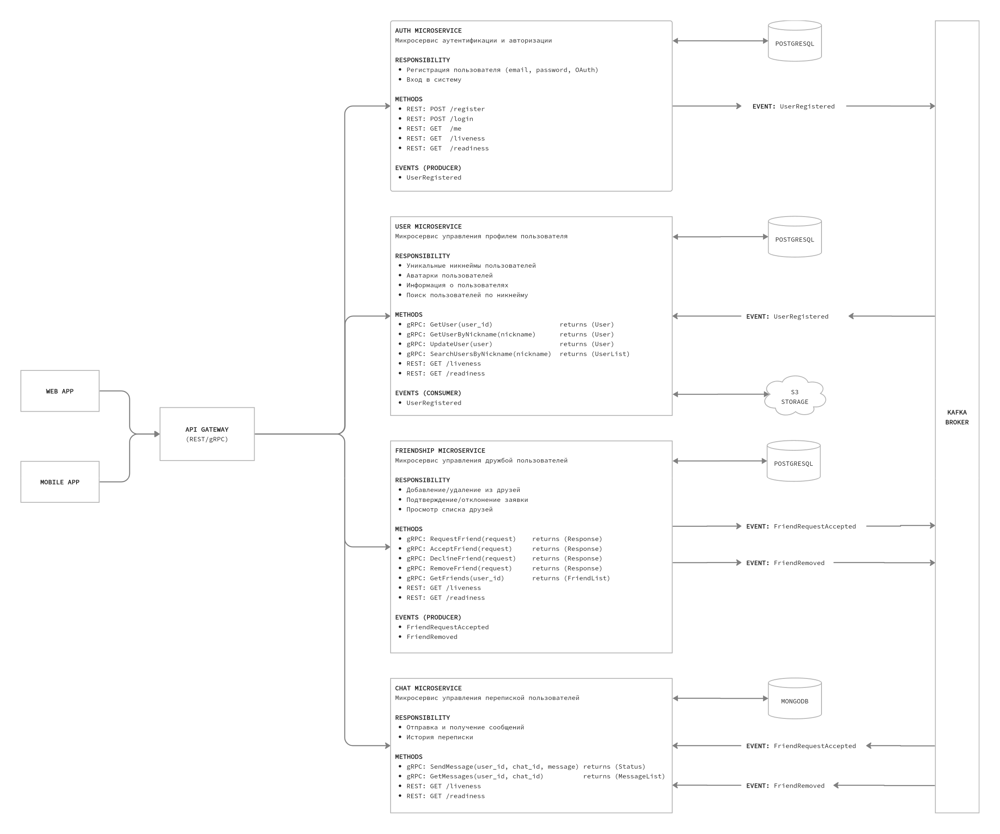

# 🧩 chat-platform — микросервисная платформа для общения

  

## 📚 Оглавление

- [Описание](#описание)
- [Компоненты](#микросервисы)
- [Архитектура](#архитектура)
- [Статус](#статус)

## 🧠 Погодите... Это не один сервис?

Нет. Это распределённая система, где каждый компонент отвечает только за своё, не лезет в чужие дела и падает исключительно по своей инициативе.  
gRPC, Kafka, отдельные БД — всё как в продакшене, только без продакшена.

## 📌 Описание

**chat-platform** — это проект для отработки архитектурных и инженерных подходов в построении микросервисной чат-системы.  
Здесь нет общих баз данных, нет скрытых зависимостей и нет лёгких путей. Зато есть чёткая структура, событийное взаимодействие и устойчивость к случайным действиям разработчика (ну, почти).

Ключевые цели:
- Разделение ответственности между сервисами
- Асинхронность через Kafka
- Централизованный вход через API Gateway
- Интеграция разных типов хранилищ под конкретные задачи

---

## 🧱 Микросервисы

Каждый сервис отвечает за отдельную бизнес-область. Это позволяет минимизировать связность, улучшить масштабируемость и упростить сопровождение.

- **Auth Service**  
  Отвечает за регистрацию пользователей, вход в систему и проверку подлинности.

- **User Service**  
  Управляет пользовательскими профилями: именами, изображениями, общедоступной информацией.  
  Поддерживает обновление данных и поиск пользователей по заданным критериям.

- **Friendship Service**  
  Обеспечивает управление социальной связью между пользователями.  
  Поддерживает отправку заявок в друзья, подтверждение или отклонение, а также просмотр текущих связей.  
  Формирует структуру взаимодействий между людьми — без лишних эмоций, только логика.

- **Chat Service**  
  Обрабатывает обмен сообщениями между пользователями.  
  Хранит историю переписки и предоставляет доступ к ней при необходимости.  
  Работает тихо, надёжно и всегда по делу.

---

## ⚙️ Архитектура

- [Обоснование выбора баз данных](./docs/db-choice.md)

Схема проекта _(можно кликнуть, чтобы посмотреть схему в полном размере)_

- **gRPC** — внутренняя коммуникация между сервисами
- **Kafka** — события и асинхронные связи
- **PostgreSQL** — для структурированных данных (auth, users, friends)
- **MongoDB** — для гибких и быстрорастущих данных (сообщения)
- **S3** — для хранения медиа и файлов вне БД

---

## 🚧 Статус

Проект в разработке. Сервисы запускаются по отдельности, постепенно объединяются в единую систему.  
Основная цель — создание надёжной, масштабируемой архитектуры с приоритетом на читаемость и предсказуемость кода.
