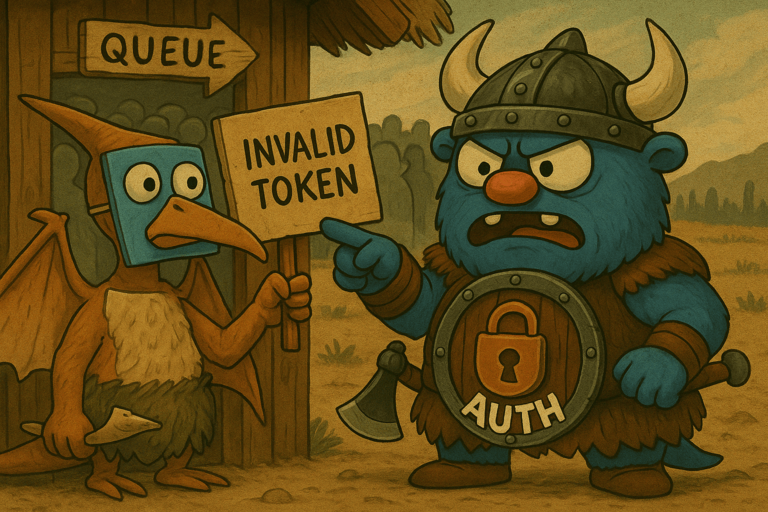

# 🔐 Auth Service


<div style="text-align: left;">
  
</div>


Сервис авторизации и аутентификации пользователей.

## 📚 Оглавление

- [Описание](#описание)
- [Установка и запуск](#установка-и-запуск)
- [Документация API](#документация-api)
- [Статус](#статус)


<a name="описание"></a>
## 🧩 Назначение

Управление регистрацией, входом в систему и валидацией токенов доступа.

---

## 🚀 Основные возможности

- Регистрация нового пользователя
- Аутентификация пользователя и получение токена
- Выход пользователя (инвалидация сессии/токена)
- Документация API через встроенный Swagger UI

---

<a name="установка-и-запуск"></a>
## 🛠 Установка и запуск локально

### Требования

- Go 1.24+
- Docker и Docker Compose (если нужно тестировать контейнеризацию)


### Запуск сервиса локально

Установка зависимостей

```bash
go mod tidy
```

Запуск

```bash
go run ./cmd/server
```
После запуска сервер будет доступен на `http://localhost:8080`

### 🐳 Запуск в Docker

#### Сборка Docker-образов

- Простая сборка

```bash
make build-simple
```

- Мультистейдж сборка

```bash
make build-multi
```

#### Запуск контейнера

В зависимости от сборки необходимо запустить

```bash
docker run -p 8080:8080 auth:simple
```

или

```bash
docker run -p 8080:8080 auth:multi
```

---

<a name="документация-api"></a>
## 📖 Документация API

После запуска сервиса Swagger UI доступен по адресу:

[http://localhost:8080/swagger/index.html](http://localhost:8080/swagger/index.html)

Документация описывает доступные эндпоинты для:

- Регистрации пользователя
- Логина (получение токена доступа)
- Выхода из системы

### 📚 Генерация (обновление) Swagger-документации

При изменении аннотаций API необходимо обновлять документацию:

```bash
make update-swagger-docs
```

Команда автоматически перегенерирует `swagger.json`, `swagger.yaml` файлы в директории `auth/api/openapi` и `docs.go` в директории `services/auth/docs/swagger` 

---

<a name="cтатус"></a>
## 🚧 Статус

Микросервис находится на этапе разработки.  
Пока что сервис не принимает запросов, но скоро будет стоять на страже доступа.

