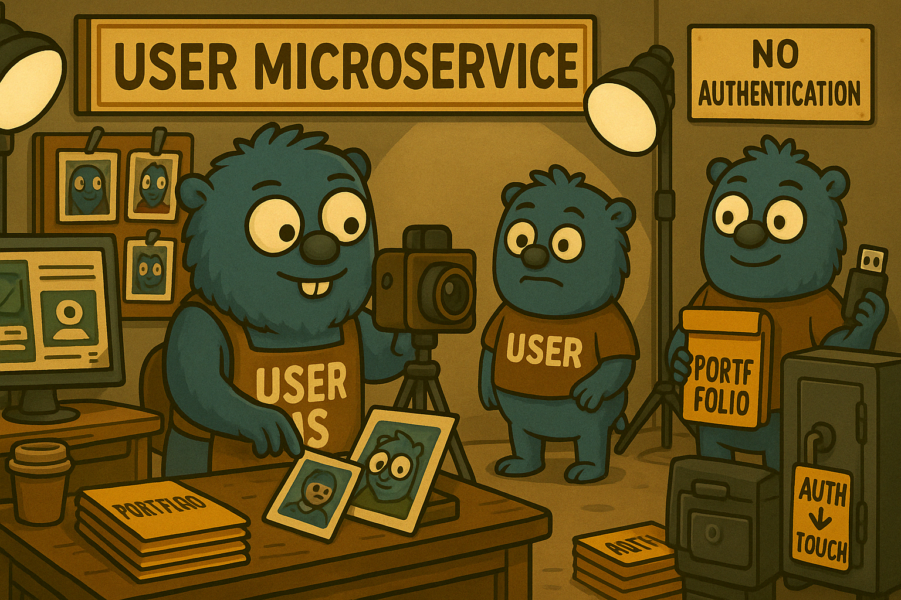

# 👤 User Service

  

Сервис управления пользовательскими профилями.

## 🧩 Назначение

Хранение и обновление информации о пользователе, включая имя, аватар и публичные данные.

## 🚧 Статус

Реализация на этапе проектирования.  
Скоро начнёт узнавать пользователей ближе.
